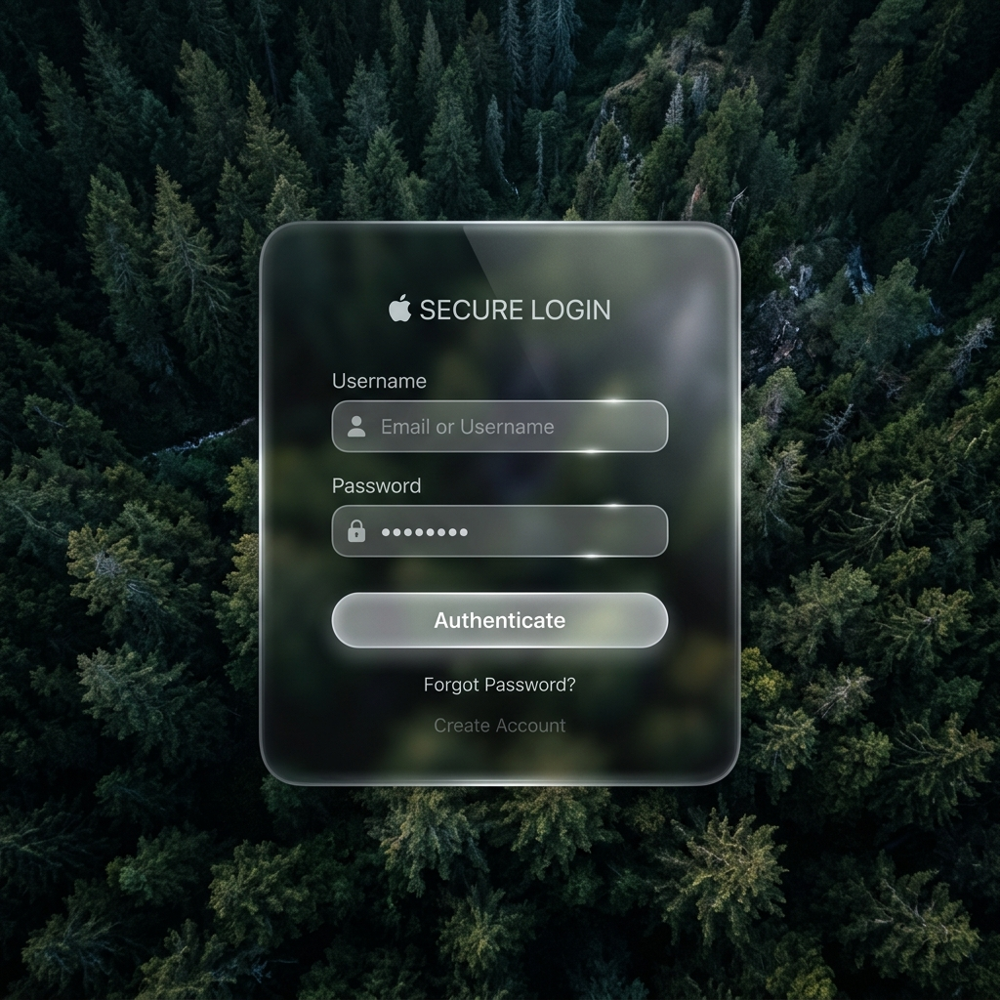

<div align="center">

# 🧊 Liquid Glass Element

### Transform any HTML element into Apple's Liquid Glass aesthetic



[](LICENSE)
[](#-agent-skill-installation)
[](#)

**A dual-layer WebGL + CSS rendering engine that applies physically accurate frosted glass blur, 3D edge refraction with organic pillow-bulge normals, Fresnel reflections, specular highlights, and sub-pixel anti-aliased edges — to any HTML element.**

[Live Preview](#-quick-start) · [Agent Skill Install](#-agent-skill-installation) · [Architecture](#-architecture) · [Customization](#-customization)

</div>

---

## ✨ Features

| Feature | Description |
|---|---|
| 🔬 **Sub-pixel Anti-Aliasing** | Cubic hermite `smoothstep` for microscopically smooth edges |
| 🌊 **Organic Pillow Bulge** | SDF normals blended with spherical projection — no flat edges |
| 💎 **Physically Accurate Refraction** | IOR-based background distortion through the glass bevel |
| ✨ **Fresnel & Specular Lighting** | View-dependent glow and sharp specular highlights |
| 🫧 **Gaussian Edge Blending** | Infinite `exp()` falloff — zero visible seam between bevel and center |
| 🧊 **Native CSS Frosted Blur** | Hardware-accelerated `backdrop-filter` for flawless Gaussian frosting |
| 🖱️ **Draggable & Resizable** | 8-way edge/corner resizers with spongy spring-damper physics |
| 🎚️ **Blur Slider** | Real-time frosting control via CSS custom properties |

---

## 🚀 Quick Start

### 1. Clone the repo

```bash
git clone https://github.com/YOUR_USERNAME/Liquid-Glass-Element.git
cd Liquid-Glass-Element
```

### 2. Open the preview

Simply open `preview/index.html` in any modern browser (Chrome, Edge, Firefox, Safari).

No build step. No dependencies. No npm install. **Just open the file.**

```bash
# Or use a local server for best results:
npx serve preview
```

### 3. Interact

- **Drag** the panel by clicking anywhere on the glass surface
- **Resize** by hovering near any edge or corner — glowing handles will appear
- **Adjust blur** using the frosting slider in the top right

---

## 🤖 Agent Skill Installation

This project is packaged as an **agent skill** compatible with:

- [Antigravity](https://github.com/google-deepmind/antigravity)
- [Claude Code](https://docs.anthropic.com/en/docs/claude-code)
- [Codex](https://openai.com/codex)
- [OpenCode](https://github.com/opencode-ai/opencode)
- Any coding agent that supports the `/` skill system

### Install

```bash
# Clone into your agent's skills directory
git clone https://github.com/YOUR_USERNAME/Liquid-Glass-Element.git ~/.agents/skills/liquid-glass-element
```

Or add to your agent's `skills.json`:

```json
{
  "entries": [
    { "path": "~/.agents/skills/liquid-glass-element/skills/liquid-glass-element" }
  ]
}
```

### Usage

Once installed, use the skill in any conversation with your coding agent:

```
/liquid-glass-element

Apply the Liquid Glass effect to my signup form
```

The agent will automatically:
1. Add the WebGL canvas and shader program to your page
2. Apply the frosted glass CSS to your target element
3. Wire up the render loop to track your element's position
4. Optionally add dragging, resizing, and blur controls

---

## 🏗️ Architecture

```
┌─────────────────────────────────────────────────┐
│                  Browser Window                  │
│                                                  │
│  ┌─── z-index: body ──────────────────────────┐ │
│  │  CSS background-image (forest wallpaper)    │ │
│  └─────────────────────────────────────────────┘ │
│                                                  │
│  ┌─── z-index: 1 (WebGL Canvas) ──────────────┐ │
│  │  • SDF Rounded Rectangle evaluation         │ │
│  │  • Gaussian bevel falloff                   │ │
│  │  • Pillow-bulge normal blending             │ │
│  │  • Refraction (IOR = 0.03)                  │ │
│  │  • Fresnel + Specular lighting              │ │
│  │  • smoothstep anti-aliasing                 │ │
│  │  pointer-events: none                       │ │
│  └─────────────────────────────────────────────┘ │
│                                                  │
│  ┌─── z-index: 2 (HTML DOM Element) ──────────┐ │
│  │  • backdrop-filter: blur(35px)              │ │
│  │  • Glass borders & shadows                  │ │
│  │  • Interactive content (forms, buttons)      │ │
│  │  • 8-way resize handles                     │ │
│  └─────────────────────────────────────────────┘ │
└─────────────────────────────────────────────────┘
```

The key insight: **CSS `backdrop-filter` handles the frosted blur** (using the browser's native hardware-accelerated multi-pass Gaussian), while **WebGL renders the 3D edge bevels** underneath. This separation achieves physically accurate glass at 60fps.

---

## 🎛️ Customization

All parameters are tunable via CSS custom properties and shader uniforms:

| Parameter | Default | Description |
|---|---|---|
| `--blur-amount` | `35px` | Frosted glass blur radius |
| `--glass-radius` | `32px` | Corner radius of the glass panel |
| `glassIOR` | `0.03` | Index of Refraction for edge distortion |
| `pillowBlend` | `0.15` | Organic pillow bulge strength |
| `bevelSigma` | `25.0` | Gaussian bevel falloff width |
| `fresnelPower` | `4.0` | Fresnel exponent |
| `specularPower` | `32.0` | Specular highlight sharpness |

---

## 📁 Project Structure

```
Liquid-Glass-Element/
├── preview/                    # Standalone HTML preview (open in browser)
│   ├── index.html
│   ├── style.css
│   └── app.js
├── skills/                     # Agent skill package
│   └── liquid-glass-element/
│       ├── SKILL.md            # Skill instructions for coding agents
│       ├── references/
│       │   └── shader-math.md  # Optical math documentation
│       └── examples/
│           └── login-panel/    # Reference implementation
│               ├── index.html
│               ├── style.css
│               └── app.js
├── assets/
│   └── hero.png                # Hero image for README
├── HANDOFF.md                  # Technical handoff document
├── LICENSE
└── README.md
```

---

## 🔬 Optical Math

The shader simulates real glass optics using:

- **Signed Distance Fields** — `sdRoundedBox()` for pixel-perfect geometry
- **Gaussian Bevel** — `exp(-pow(d/σ, 2))` for seamless edge-to-center blending
- **Pillow Bulge** — `normalize(mix(sdfNormal, p/maxDim, 0.15))` for organic curvature
- **Fresnel Reflections** — `pow(1 - dot(N, V), 4)` for view-dependent glow
- **Specular Highlights** — `pow(dot(R, V), 32)` for sharp light reflections
- **Hermite Anti-Aliasing** — `smoothstep(1, -1, d)` for sub-pixel smooth edges

See [shader-math.md](skills/liquid-glass-element/references/shader-math.md) for the full mathematical breakdown.

---

## 📄 License

MIT License — free for personal and commercial use.

---

<div align="center">

**Built with 🧊 WebGL + CSS `backdrop-filter` + advanced optical mathematics**

*Inspired by Apple's Liquid Glass design language. No proprietary assets used.*

</div>
